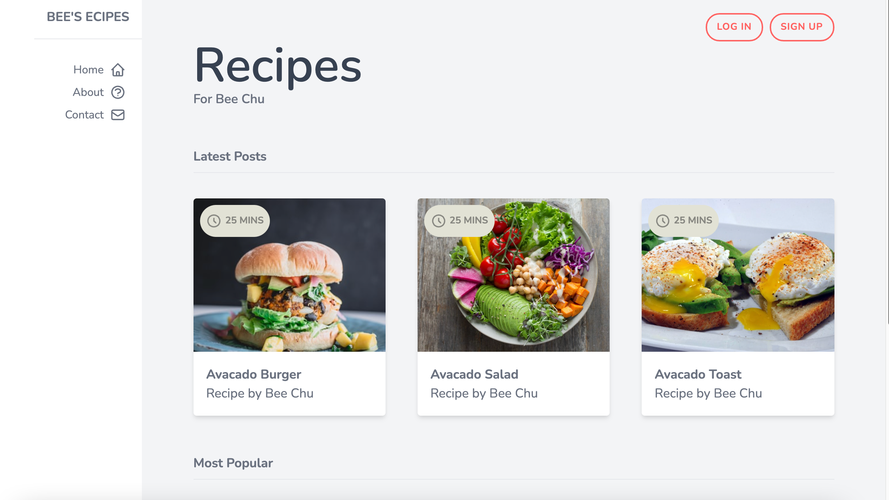

<!-- PROJECT SHIELDS -->
<!--
*** I'm using markdown "reference style" links for readability.
*** Reference links are enclosed in brackets [ ] instead of parentheses ( ).
*** See the bottom of this document for the declaration of the reference variables
*** for contributors-url, forks-url, etc. This is an optional, concise syntax you may use.
*** https://www.markdownguide.org/basic-syntax/#reference-style-links
-->


<!-- ABOUT THE PROJECT -->
## About The Project




This is a front-end web app with tailwind css and Next.js demo


### Built With


* [NEXT.JS](https://nextjs.org/)
* [TailwindCSS](https://tailwindcss.com/)


<!-- GETTING STARTED -->
## Getting Started


### Prerequisites

This is an example of how to list things you need to use the software and how to install them.
* npm
  ```sh
  npm install npm@latest -g
  ```

### Installation

1. Get a free API Key at [https://example.com](https://example.com)
2. Clone the repo
   ```sh
   git clone https://github.com/your_username_/Project-Name.git
   ```
3. Install NPM packages
   ```sh
   npm install
   ```


<!-- LICENSE -->
## License

Distributed under the MIT License. See `LICENSE` for more information.


<!-- CONTACT -->
## Contact

Your Name - [@your_twitter](https://twitter.com/your_username) - jimmyleu76@gmail.com

Project Link: [https://github.com/catzzz/recipes-front-end](https://github.com/catzzz/recipes-front-end)


